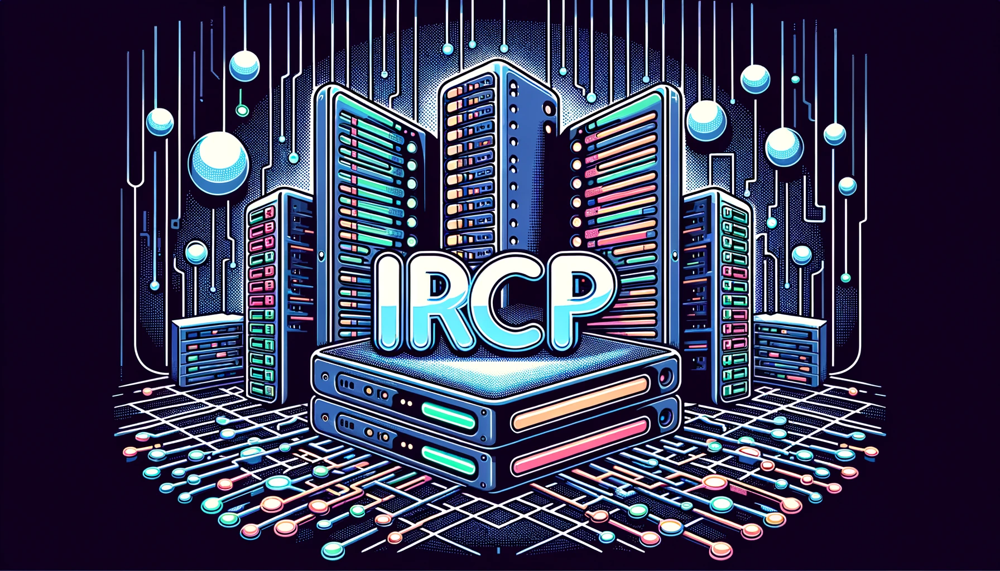

# Internet Relay Chat Plus

> **Warning**
>
> This project is under development. Its current status is UNSTABLE.

## Brief
Internet Relay Chat Plus is a learning project to create an IRC-like server from scratch using modern C++23.

- [Read about IRCP Protocol here](./doc/IRCP-Protocol-Specification-v1.0.txt)

## Conventions and Standards
- clang-format (included in project. **WORK IN PROGRESS**)

## Contributing

This is a project that I'm using for my personal learning. However, if you wish to participate, you're welcome to copy 
the project, make your modifications, and then submit a request to include your changes in the original project. This is
a way for you to contribute to the project or share any enhancements that you've made.

## Acknowledgements

- [Boost.Asio](https://www.boost.org/doc/libs/1_77_0/doc/html/boost_asio.html) - The Boost.Asio library for asynchronous I/O and networking.
- [Hands-On Network Programming with C](https://handsonnetworkprogramming.com/) - A modern approach to socket programming in the C or C++ programming language.
- [Zator Systems](https://www.zator.com/Internet/index.htm) - A spanish website about internet and its history.

## License
Copyright (c) 2023 Javier Castro - jcastro0x@gmail.com

Permission is hereby granted, free of charge, to any person obtaining
a copy of this software and associated documentation files (the
"Software"), to deal in the Software without restriction, including
without limitation the rights to use, copy, modify, merge, publish,
distribute, sublicense, and/or sell copies of the Software, and to
permit persons to whom the Software is furnished to do so, subject to
the following conditions:

The above copyright notice and this permission notice shall be
included in all copies or substantial portions of the Software.

THE SOFTWARE IS PROVIDED "AS IS", WITHOUT WARRANTY OF ANY KIND,
EXPRESS OR IMPLIED, INCLUDING BUT NOT LIMITED TO THE WARRANTIES OF
MERCHANTABILITY, FITNESS FOR A PARTICULAR PURPOSE AND
NON INFRINGEMENT. IN NO EVENT SHALL THE AUTHORS OR COPYRIGHT HOLDERS BE
LIABLE FOR ANY CLAIM, DAMAGES OR OTHER LIABILITY, WHETHER IN AN ACTION
OF CONTRACT, TORT OR OTHERWISE, ARISING FROM, OUT OF OR IN CONNECTION
WITH THE SOFTWARE OR THE USE OR OTHER DEALINGS IN THE SOFTWARE.

## Contact
Created by jcastro0x@gmail.com with ❤️
